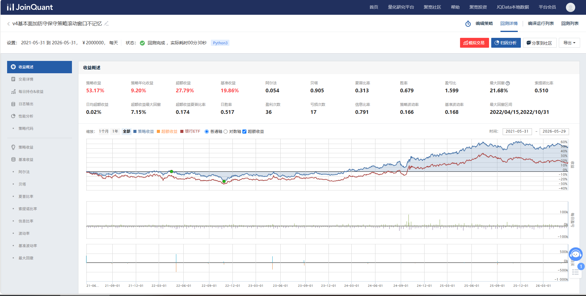
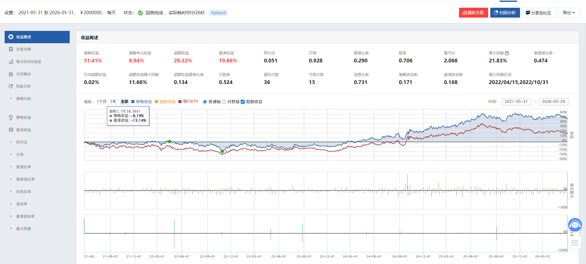
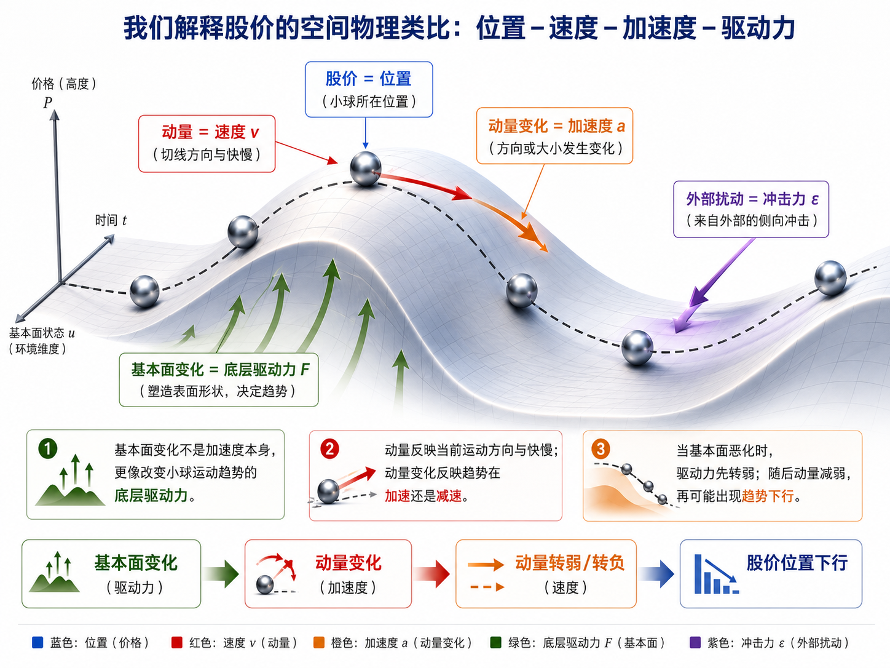

# Bank Quant V4

一个关于 A 股银行股的量化研究项目，核心关注点是：哪些信号真的有效，哪些模块只是让回测看起来更好。  
An A-share bank-stock quantitative research project focused on a simple question: which signals truly add value, and which modules merely make backtests look better.

## 项目概览 | Overview

V4 从一个更大的设想出发：基本面、动量、均值回归和防守 overlay 都曾被认真纳入研究。  
V4 started from a broader thesis: fundamentals, momentum, mean reversion, and defensive overlays were all seriously explored.

但随着 rolling 验证和 JoinQuant 可执行回测不断推进，项目最后收敛成了一个更简单的结论：  
As rolling validation and executable JoinQuant checks accumulated, the project converged to a simpler conclusion:

> 在本项目的样本、因子定义与执行框架下，真正有效的核心是纯基本面选股；风险控制应独立处理，而不是主要依赖动量去稀释权益仓位。  
> Under this project's sample, factor definitions, and execution framework, the effective alpha core is pure fundamental stock selection, while risk control should be handled independently rather than mainly through momentum dilution.

## 最终结构 | Final Structure

当前正式候选排序：  
Current formal ranking:

1. `core_level_shadow_shortbond_overlay`
2. `balanced_shortbond_overlay`
3. `pure core_level_shadow`
4. `pure balanced`

这意味着 V4 最终没有走向“基本面 + 动量 + 均值回归”的理论完整形态，而是接受了实证结果：  
This means V4 did not end as a theoretically complete "fundamental + momentum + mean reversion" framework. It accepted the empirical result instead:

- 基本面是 alpha 主体  
  Fundamentals are the alpha engine.
- shortbond overlay 是风险控制层  
  Shortbond overlay is the risk-control layer.
- 动量与均值回归退出正式主线  
  Momentum and mean reversion are outside the formal main line.

## 第一候选结果快照 | Top Candidate Snapshot

当前第一候选为 `core_level_shadow_shortbond_overlay`。  
The current top-ranked branch is `core_level_shadow_shortbond_overlay`.

JoinQuant 回测核心指标：  
Key JoinQuant backtest metrics:

- 策略收益：`53.17%`  
  Strategy return: `53.17%`
- 年化收益：`9.20%`  
  Annualized return: `9.20%`
- 超额收益：`27.79%`  
  Excess return: `27.79%`
- Alpha：`0.054`
- Beta：`0.905`
- 夏普比率：`0.313`  
  Sharpe ratio: `0.313`
- 信息比率：`0.791`  
  Information ratio: `0.791`
- 最大回撤：`21.68%`  
  Max drawdown: `21.68%`
- 超额收益最大回撤：`7.15%`  
  Excess-return max drawdown: `7.15%`
- 索提诺比率：`0.510`  
  Sortino ratio: `0.510`

回测区间：`2021-05-31` 至 `2026-05-29`；最大回撤区间：`2022/04/15` 至 `2022/10/31`。  
Backtest window: `2021-05-31` to `2026-05-29`; max drawdown interval: `2022/04/15` to `2022/10/31`.

## 第二候选结果快照 | Second Candidate Snapshot

当前第二候选为 `balanced_shortbond_overlay`。  
The current second-ranked branch is `balanced_shortbond_overlay`.

JoinQuant 回测核心指标：  
Key JoinQuant backtest metrics:

- 策略收益：`51.41%`  
  Strategy return: `51.41%`
- 年化收益：`8.94%`  
  Annualized return: `8.94%`
- 超额收益：`26.32%`  
  Excess return: `26.32%`
- Alpha：`0.051`
- Beta：`0.928`
- 夏普比率：`0.290`  
  Sharpe ratio: `0.290`
- 信息比率：`0.731`  
  Information ratio: `0.731`
- 最大回撤：`21.83%`  
  Max drawdown: `21.83%`
- 超额收益最大回撤：`11.66%`  
  Excess-return max drawdown: `11.66%`
- 索提诺比率：`0.474`  
  Sortino ratio: `0.474`

回测区间：`2021-05-31` 至 `2026-05-29`；最大回撤区间：`2022/04/15` 至 `2022/10/31`。  
Backtest window: `2021-05-31` to `2026-05-29`; max drawdown interval: `2022/04/15` to `2022/10/31`.

## 基准候选结果快照 | Benchmark Candidate Snapshot

这里的 `benchmark` 对应无 overlay 的 `pure core_level_shadow`。  
Here, the `benchmark` refers to the plain no-overlay `pure core_level_shadow`.

JoinQuant 回测核心指标：  
Key JoinQuant backtest metrics:

- 策略收益：`47.98%`  
  Strategy return: `47.98%`
- 年化收益：`8.43%`  
  Annualized return: `8.43%`
- 超额收益：`23.46%`  
  Excess return: `23.46%`
- Alpha：`0.046`
- Beta：`1.027`
- 夏普比率：`0.237`  
  Sharpe ratio: `0.237`
- 信息比率：`0.647`  
  Information ratio: `0.647`
- 最大回撤：`23.48%`  
  Max drawdown: `23.48%`
- 超额收益最大回撤：`6.89%`  
  Excess-return max drawdown: `6.89%`
- 索提诺比率：`0.387`  
  Sortino ratio: `0.387`

回测区间：`2021-05-31` 至 `2026-05-29`；最大回撤区间：`2021/06/04` 至 `2022/10/31`。  
Backtest window: `2021-05-31` to `2026-05-29`; max drawdown interval: `2021/06/04` to `2022/10/31`.

## Plain Balanced 候选快照 | Plain Balanced Snapshot

这里的 `balanced` 对应无 overlay 的 `pure balanced`。  
Here, `balanced` refers to the plain no-overlay `pure balanced`.

JoinQuant 回测核心指标：  
Key JoinQuant backtest metrics:

- 策略收益：`48.38%`  
  Strategy return: `48.38%`
- 年化收益：`8.49%`  
  Annualized return: `8.49%`
- 超额收益：`23.80%`  
  Excess return: `23.80%`
- Alpha：`0.047`
- Beta：`1.053`
- 夏普比率：`0.233`  
  Sharpe ratio: `0.233`
- 信息比率：`0.616`  
  Information ratio: `0.616`
- 最大回撤：`22.29%`  
  Max drawdown: `22.29%`
- 超额收益最大回撤：`11.47%`  
  Excess-return max drawdown: `11.47%`
- 索提诺比率：`0.383`  
  Sortino ratio: `0.383`

回测区间：`2021-05-31` 至 `2026-05-29`；最大回撤区间：`2022/04/15` 至 `2022/10/31`。  
Backtest window: `2021-05-31` to `2026-05-29`; max drawdown interval: `2022/04/15` to `2022/10/31`.

## 这个仓库记录了什么 | What This Repository Captures

- 从 `base_core_7` 到 `base_core_6` 的因子收缩过程  
  The factor-pruning path from `base_core_7` to `base_core_6`
- 纯基本面主线 `balanced` / `core_level_shadow` 的形成  
  The formation of the two main pure-fundamental branches: `balanced` and `core_level_shadow`
- 动量分支为什么在最终执行层被拒绝  
  Why the momentum branch was rejected at the final executable-validation layer
- shortbond overlay 为什么从防守旁支升级为正式候选  
  Why shortbond overlay was promoted from a defensive side branch into the formal candidate stack
- safebox 归档如何保留每一阶段的研究现场  
  How safebox archives preserve the research trail at each stage

## 一个被排除但有意思的解释框架 | An Archived but Interesting Interpretation

虽然“基本面 + 动量 + 均值回归”的正式策略结构最终被排除，但它留下了一个我认为很有意思的解释框架。  
Although the formal "fundamental + momentum + mean reversion" structure was ultimately excluded, it left behind an interpretation that I still find conceptually interesting.

这个解释把股价变化类比成一个空间中的物理过程：  
It treats stock-price movement as a physics-like process in space:

- 股价位置 = 位置 `position`
- 动量 = 速度 `velocity`
- 动量变化 = 加速度 `acceleration`
- 基本面变化 = 底层驱动力 `driving force`
- 外部扰动 = 冲击项 `shock`

直观上，它表达的是：  
Intuitively, it expresses the idea that:

- 基本面并不是价格变化本身，而是塑造长期趋势地形的底层力量  
  fundamentals are not price movement itself, but the underlying force shaping the long-run terrain
- 动量反映当前趋势方向和快慢  
  momentum reflects current direction and speed
- 动量的变化更像趋势是在加速还是减速  
  changes in momentum resemble acceleration or deceleration
- 当基本面转弱后，常常先表现为“驱动力变小”，再传导到动量衰减，最后才可能表现为价格位置下移  
  when fundamentals weaken, the first sign may be weaker driving force, then fading momentum, and only later a downward move in price position

这个物理类比并没有进入 V4 的正式执行主线，但它作为一种解释语言，仍然很有启发性。  
This physics analogy did not survive into the formal V4 execution stack, but it remains a useful explanatory language.

对应分支的 JoinQuant 回测结果为：  
The corresponding JoinQuant backtest metrics for that archived branch were:

- 策略收益：`40.09%`  
  Strategy return: `40.09%`
- 年化收益：`7.21%`  
  Annualized return: `7.21%`
- 超额收益：`16.88%`  
  Excess return: `16.88%`
- Alpha：`0.034`
- Beta：`1.006`
- 夏普比率：`0.166`  
  Sharpe ratio: `0.166`
- 信息比率：`0.368`  
  Information ratio: `0.368`
- 最大回撤：`21.30%`  
  Max drawdown: `21.30%`
- 超额收益最大回撤：`16.74%`  
  Excess-return max drawdown: `16.74%`

它之所以有意思，恰恰是因为它“解释上迷人，但执行上不够强”。  
What makes it interesting is precisely that it is conceptually appealing, yet not strong enough in execution terms.

这类分支没有被删掉，而是被保留为研究档案的一部分。  
Branches like this were not erased; they were preserved as part of the research archive.

## 纯动量研究快照 | Pure Momentum Research Snapshot

纯动量分支也被单独做过 JoinQuant 验证。  
The pure-momentum branch was also validated independently in JoinQuant.

对应的核心回测指标为：  
Its key backtest metrics were:

- 策略收益：`33.84%`  
  Strategy return: `33.84%`
- 年化收益：`6.20%`  
  Annualized return: `6.20%`
- 超额收益：`11.66%`  
  Excess return: `11.66%`
- Alpha：`0.024`
- Beta：`1.054`
- 夏普比率：`0.108`  
  Sharpe ratio: `0.108`
- 信息比率：`0.235`  
  Information ratio: `0.235`
- 最大回撤：`23.75%`  
  Max drawdown: `23.75%`
- 超额收益最大回撤：`18.45%`  
  Excess-return max drawdown: `18.45%`
- 索提诺比率：`0.175`  
  Sortino ratio: `0.175`

回测区间：`2021-05-31` 至 `2026-05-29`；最大回撤区间：`2021/06/04` 至 `2021/08/05`。  
Backtest window: `2021-05-31` to `2026-05-29`; max drawdown interval: `2021/06/04` to `2021/08/05`.

另外，还测试过一版“基本面与动量独立仓位配额”的组合结构。  
In addition, a separate mixed structure with independent fundamental and momentum sleeves was also tested.

那一版的总回撤一度压到约 `10%` 左右，风险外观很有吸引力；但因为整体收益不高，最终没有写入正式候选展示层。  
That version reduced total drawdown to around `10%`, which made its risk profile visually appealing; however, because the return level was not strong enough, it was not included in the formal candidate presentation layer.

## 研究方法 | Research Approach

这个项目最重要的部分，不只是结果本身，而是研究纪律。  
The most important part of this project is not only the results, but the research discipline behind them.

V4 后期逐渐固定了一个很明确的证据顺序：  
Late in V4, the workflow settled into a clear evidence hierarchy:

1. 本地 rolling 负责提出候选  
   Local rolling generates candidates.
2. JoinQuant 可执行回测负责最终接受或拒绝  
   Executable JoinQuant results decide final acceptance or rejection.

这也是为什么这个项目最后会变得更简单，而不是更复杂。  
That is also why the final structure became simpler rather than more complex.

## 仓库结构 | Repository Structure

- `phase_1_fundamental`  
  纯基本面主线、因子筛选、rolling 验证、JoinQuant 执行版本  
  Pure-fundamental core, factor selection, rolling validation, and JoinQuant execution versions

- `phase_2_momentum`  
  动量、双引擎、手动切换等研究分支  
  Momentum, dual-engine, and manual-switch research branches

- `phase_3_mean_reversion`  
  均值回归与价格层辅助研究  
  Mean-reversion and price-layer supporting research

- `safebox_*`  
  分阶段归档快照，保留研究过程与当时结论  
  Time-stamped archive snapshots preserving intermediate decisions and context

## 推荐阅读 | Suggested Reading

1. [v4_full_project_report_executive_summary_2026-06-24.md](./v4_full_project_report_executive_summary_2026-06-24.md)
2. [v4_full_project_report_2026-06-24.md](./v4_full_project_report_2026-06-24.md)
3. [phase_1_fundamental/v4_final_structure_2026-06-23.md](./phase_1_fundamental/v4_final_structure_2026-06-23.md)
4. [phase_1_fundamental/v4_final_candidate_ranking_2026-06-23.md](./phase_1_fundamental/v4_final_candidate_ranking_2026-06-23.md)

## 个人陈述 | Personal Note

这份仓库也是一份个人学习记录。  
This repository is also a personal learning record.

作者没有系统性学习过金融学知识，也并非金融或相关专业出身；项目中相当一部分具体代码实现由 AI 协助完成。  
The author has not received systematic academic training in finance and is not from a finance-related major; a substantial portion of the concrete code implementation was completed with AI assistance.

因此，这个仓库更适合被理解为一个尽量诚实保留研究轨迹的项目归档，而不是一个已经被完整证明、可以直接迁移到真实资金上的成熟产品。  
Accordingly, this repository is best read as an honest archive of an evolving research process rather than as a fully proven product ready for direct capital deployment.

## 免责声明 | Disclaimer

本仓库仅作为个人研究与学习记录，不构成任何投资建议。  
This repository is a personal research and learning record and does not constitute investment advice.

仓库中的策略结果仅基于历史回测，没有经过实盘验证，可能存在过拟合、执行偏差、样本特异性以及本地研究与真实部署之间的落差。  
The strategy results shown here are based on historical backtests only and have not been validated by live trading. They may contain overfitting risk, execution bias, sample-specific distortions, and gaps between local research and real deployment.

值得强调的是，仓库中的部分数据来自 Tushare 和 JoinQuant 的付费渠道；如需引用、转载或二次分发相关数据与结果，请自行注意对应的数据授权边界与法律风险。  
It is worth emphasizing that part of the data used in this repository comes from paid Tushare and JoinQuant channels. If you plan to quote, redistribute, or reuse related data or results, please pay attention to the relevant licensing boundaries and legal risks on your own.

作者没有做过实盘，也并不知道这些策略在真实交易中的实际表现究竟会怎样。  
The author has not run these strategies in live trading and does not know how they would actually perform in real execution.

如果这份仓库对你有一点帮助，也欢迎点个赞。  
If this repository is even a little helpful to you, a star or like would be greatly appreciated.
